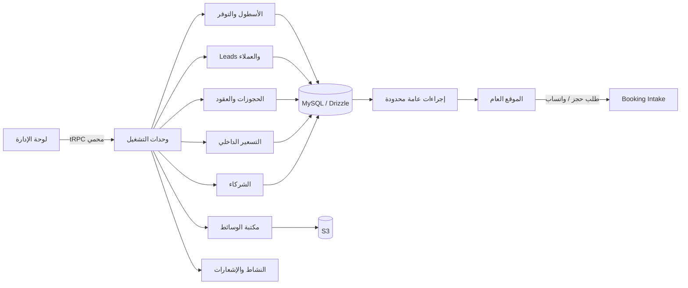

# مقترح معماري للوحة إدارة ZAVERRE

**الإصدار:** مقترح للموافقة قبل التنفيذ  
**المنهج:** توسعة تدريجية آمنة، لا إعادة بناء موازية، ولا تغيير في بيانات السيارات أو الأسعار أو الصور أو شروط الإيجار الحالية.

## الملخص التنفيذي

يمتلك المشروع بالفعل نواة إدارية جيدة تشمل مصادقة محمية، لوحة عمليات، استوديو للمركبات والعلامات والأسعار والاستيراد، صندوق طلبات الحجز، استوديو محتوى، سجل نشاط، ورفع صور إلى التخزين. لكن هذه النواة ليست بعد نظام تشغيل تأجير كامل؛ إذ لا توجد طبقات مستقلة للعملاء والشركاء والعقود والتوفر والدفعات والـCRM والصلاحيات الدقيقة. المقترح هو **توسعة النظام الحالي** عبر وحدات مترابطة ومراحل نشر آمنة، لا استبدال مصادر البيانات العامّة أو ترحيلها دفعة واحدة.

> **قرار معماري رئيسي:** يبقى كتالوج الموقع العام الحالي مصدرًا تشغيليًا حتى يعتمد المالك خريطة مطابقة `vehicleKey` لكل مركبة. تضيف لوحة الإدارة بيانات تشغيلية وتجارية داخلية حوله، ولا تكشفها للإجراءات العامة.

| المحور | الوضع الحالي | المقترح |
|---|---|---|
| الأسطول | كتالوج ثابت مع طبقة override إدارية | طبقة عمليات مرتبطة بـ `vehicleKey` قبل أي نقل للمصدر |
| الحجز | طلبات بثلاث حالات | سجل حجز وCRM وحالة زمنية وسجل تغييرات |
| التسعير | سعر عام وحقلا B2B/markup أوليان | أسعار داخلية وقواعد مدة وفترات وعروض بموافقة صريحة |
| الصلاحيات | `user` و`admin` | RBAC قابل للتخصيص مع طبقة نطاق سجلية مستقبلية |
| الوسائط | صور مركبات ورفع S3 | مكتبة أصول وارتباطات بالسيارة/العلامة/المحتوى |
| التقارير | مؤشرات تشغيلية محدودة | تقارير محسوبة من الحجز والدفعات والحالة، بلا أرقام افتراضية |

## 1. نتيجة تدقيق الوضع الحالي

تعمل لوحة الإدارة الحالية ضمن React وWouter في الواجهة، وtRPC/Express في الخادم، وDrizzle/MySQL للبيانات. الوصول الإداري محمي بالمصادقة ودور `admin`، كما أن إجراءات المركبات الإدارية منفصلة عن إجراءات العرض العام؛ وهذا أساس مناسب لتوسعة آمنة.

| ما هو موجود الآن | ما يمكن إعادة استخدامه | الملاحظة |
|---|---|---|
| `DashboardLayout` متجاوب مع قائمة جانبية وهاتف | هيكل التطبيق الإداري | يعاد تنظيم التنقل ولا يعاد بناؤه من الصفر |
| Operations cockpit | KPIs وHealth وسجل نشاط وقائمة طلبات حديثة | تتوسع المقاييس من بيانات حقيقية فقط |
| Vehicle studio | محتوى المركبة، السعر العام، الظهور، الصور، الاستيراد | يبقى أساسًا لمرحلة Fleet Operations |
| Brand manager | العلامات والشعارات والترتيب والظهور | يعاد استخدامه كما هو مع ربط اختياري بالمورد |
| Booking inbox | طلبات الحجز وحالات `new/contacted/closed` | تصبح بوابة إدخال إلى Booking/Lead CRM |
| Content studio | إعدادات، مقالات، FAQ، اتصال، مركبات مميزة | يبقى CMS محدود النطاق ولا ينقل كل النصوص عشوائيًا |
| S3 storage | رفع أصول عبر الخادم ومفاتيح تخزين | أساس Media Library؛ لا تحفظ bytes داخل DB |
| Activity log | تسجيل تغييرات إدارية | يتوسع إلى before/after وسبب التغيير وربط المستخدم |

### لقطة قاعدة البيانات الحالية

القراءة كانت إحصائية فقط. يوجد override واحد لمحتوى مركبة، وثلاث هويات علامات مدارة، وثلاثة إعدادات محتوى، وثلاثة مقالات، وخمسة FAQ، وتسعة أحداث نشاط. ولا توجد حاليًا طلبات حجز أو صور مركبات مدارة أو كوبونات مستخدمة. هذا يؤكد أن **مرحلة تهيئة البيانات والمطابقة أهم من بناء تقارير مالية أو تقويم حي**.

| الجداول القائمة | دورها الحالي | تقييمها |
|---|---|---|
| `vehicleContent`, `vehicleImages`, `vehicleBrands` | overrides عامة، صور، وشعارات | قابلة للتوسعة ولا تكفي لتشغيل الإيجار |
| `bookingEnquiries` | طلبات أولية وبيانات اتصال | تصلح كمصدر Lead لا كسجل إيجار نهائي |
| `adminActivityLog` | نشاط إداري موجز | يحتاج تفاصيل before/after ونوع الحدث |
| `contentSettings`, `journalEntries`, `siteFaqEntries` | CMS محدد | يبقى منفصلًا عن عمليات التأجير |
| `firstBookingCoupons` | خصم أول حجز | لا يُربط بمحرك تسعير جديد قبل اعتماد السياسات |

## 2. الفجوات التي يجب إغلاقها

لا توجد حاليًا كيانات مستقلة للعملاء أو الشركاء أو الأسعار حسب المدة أو كتل عدم التوفر أو الحجوزات النهائية أو الدفعات أو العملاء المحتملين أو الإشعارات أو صلاحيات قابلة للتخصيص. كما أن دور المستخدم لا يميّز بين المبيعات والمالية والمحتوى والعمليات. لذلك يجب عدم إضافة حقول مالية حساسة إلى الإجراءات العامة أو الاعتماد على إخفاء زر في الواجهة لحمايتها.

منصات التأجير المرجعية تربط الطلب بحالة المركبة والعميل والعقد والدفعة والفحص والتقارير في دورة واحدة، وتفصل بين الحجز الأولي وإدارة التشغيل الفعلية [1]. كما أن التقويم الفعال يتطلب منع التعارضات وفواصل تجهيز وصيانة وإشعارات وحالات واضحة [2].

## 3. المعمارية المقترحة

| الطبقة | المسؤولية | قاعدة الحماية |
|---|---|---|
| Public Read API | أسعار ومحتوى وصور مصرح بنشرها فقط | لا تعيد B2B أو التكلفة أو commission أو margin |
| Admin API | CRUD وحالات وتشغيل ومراجعات | فحص capability خادمي لكل إجراء ولكل سجل |
| Domain Services | منع تعارض الحجز، حساب السعر، التحويلات المسموحة | لا تُوزع هذه القواعد داخل مكوّنات الواجهة |
| Database | مصدر الحقائق التشغيلية وسجل التغيير | مفاتيح خارجية وفهارس وقيود حالة |
| S3 | bytes للصور والوثائق | تحفظ المفاتيح والـmetadata فقط في DB |
| Audit/Notifications | من عدّل ماذا ومتى، وإشعارات الحدث | سجل append-only وتنبيهات قابلة للقراءة |

## 4. نموذج البيانات المقترح

يُنفّذ هذا النموذج **كإضافات فقط** في البداية، ولا يستبدل الجداول الحالية أو معرفات المركبات. كل التاريخ يُخزن UTC، وكل أموال AED كأعداد صحيحة بالفلس أو الدرهـم وفق قرار محاسبي معتمد قبل التنفيذ.

| الوحدة | الجداول المقترحة | الغرض |
|---|---|---|
| الهوية والصلاحيات | `roles`, `permissions`, `userRoles`, `rolePermissions` | فصل دور المستخدم عن صلاحياته القابلة للتعديل |
| الأسطول | `vehicleOperations`, `vehicleStatusHistory`, `availabilityBlocks` | حالة Available/Reserved/Rented/Maintenance/Hidden، العداد، التوقف، سبب الحالة |
| الشركاء | `partners`, `partnerContacts`, `partnerVehicleTerms` | مورد المركبة، عقده، تكلفة B2B، العمولة، الرسوم، الصلاحية |
| التسعير | `vehiclePriceRules`, `priceRuleWindows`, `promoRules` | سعر عام معتمد وقواعد المدة/الفترة؛ لا تفعل تلقائيًا قبل اعتماد البيانات |
| العملاء وLeads | `customers`, `leads`, `leadActivities`, `leadAssignments` | توحيد العميل ومصدره وملاحظاته ومتابعاته وتحويله |
| الحجز | `bookings`, `bookingStatusHistory`, `bookingAssignments`, `bookingCharges` | دورة New → Pending → Confirmed → Paid → Active → Completed/Cancelled |
| الدفعات | `payments`, `deposits`, `refunds` | تسجيل الحالة والمبلغ والمرجع فقط؛ لا تخزن بيانات البطاقة |
| الوسائط | `mediaAssets`, `mediaLinks` | مفتاح S3، MIME، حجم، وصف، وعلاقة بالأصل |
| الإشعارات والتدقيق | `notifications`, `auditEvents` | إشعار داخلي وسجل before/after وactor وسبب |

### حالات محكومة

| الكيان | الحالات المقترحة | قاعدة انتقال مختصرة |
|---|---|---|
| Vehicle | Available, Reserved, Rented, Maintenance, Hidden | لا يصبح Rented دون حجز مؤكد؛ الصيانة تحجب التوفر |
| Lead | New, Contacted, Qualified, Quoted, Booked, Lost | كل تحويل يُسجل في activity timeline |
| Booking | New, Pending, Confirmed, Paid, Active, Completed, Cancelled | يمنع تعارض الفترة قبل Confirmed؛ لا تحذف السجلات |
| Payment | Pending, Authorized, Paid, Refunded, Failed | المصدر والمرجع فقط، بلا بيانات بطاقات |

## 5. الصلاحيات والأمن

نموذج البدء المقترح هو **RBAC بسيط مع capabilities**، ثم إضافة قيود نطاق السجل عند الحاجة، مثل موظف مبيعات لا يرى إلا العملاء المحتملين المعيّنين له. الإخفاء في الواجهة ليس تحكمًا بالوصول؛ OWASP توصي بالرفض افتراضيًا وفحص الإذن على كل طلب داخل API الخادمية [3] [4].

| الدور | وصول أساسي | محظورات صريحة |
|---|---|---|
| Super Admin | كل الوحدات، المستخدمون، الإعدادات، التقارير | لا حذف مادي للسجلات التشغيلية؛ أرشفة فقط |
| Manager | الأسطول، الحجوزات، العملاء، التقويم، الشركاء | لا يدير صلاحيات Super Admin |
| Sales | Leads والعملاء والحجوزات المعيّنة | لا يرى B2B/commission/margin أو تقارير ربحية |
| Finance | أسعار داخلية، دفعات، تقارير وربحية | لا ينشر محتوى الموقع أو يغير صلاحياته |
| Content Manager | محتوى، SEO، وسائط، علامات | لا يرى التكلفة أو بيانات العميل الحساسة |

**ضوابط إلزامية عند التنفيذ:**

1. `adminProcedure` الحالية تتحول إلى `requireCapability(capability)` في كل tRPC procedure الحساسة.
2. كل استعلام داخلي يختار صراحة الأعمدة المسموحة؛ لا يعاد استخدام DTO عام قد يحتوي B2B أو PII.
3. تتحقق الخدمة من انتقال الحالة ومن التعارض الزمني قبل تأكيد الحجز.
4. تسجل كل عملية إنشاء/تعديل/تصدير/محاولة رفض في `auditEvents`، مع actor ووقت وموضوع وbefore/after مقيّدين.
5. تضاف اختبارات وصول إيجابية وسلبية لكل capability، واختبارات IDOR للمعرفات القابلة للتخمين.
6. تطبق rate limits على طلبات الحجز والتصدير ورفع الملفات، ويُفرض حد نوع/حجم الملف خادميًا.

## 6. مقترح UX/UI

اللوحة ليست نسخة من الواجهة العامة. تبقى بهوية ZAVERRE الهادئة، لكن بأسلوب **Luxury SaaS** وظيفي: كثافة معلومات معقولة، حالات واضحة، إجراءات قابلة للتراجع، وتخطيط هاتف يعتمد بطاقات وخطوات لا جداول عريضة.

| منطقة الواجهة | المحتوى المقترح | سلوك الهاتف |
|---|---|---|
| الشريط الجانبي | Overview، Fleet، Calendar، Bookings، Leads، Customers، Partners، Pricing، Media، Content، Reports، Settings | Drawer مع شريط إجراءات ثابت |
| Topbar | بحث عام، نطاق التاريخ، مركز إشعارات، مستخدم، breadcrumb | بحث موجه وفلترة داخلية بدل جدول مزدحم |
| Overview | KPI حقيقية، backlog، تنبيهات، مهام اليوم، نشاط حديث | KPI شبكي 2×N وبطاقات قابلة للفتح |
| Fleet | قائمة/بطاقات، الحالة، التوفر، سعر عام، إجراءات | بطاقة مركبة مع tabs: عام، عمليات، أسعار، صور |
| Booking detail | عمود العميل، عمود الإيجار، عمود المالية، timeline | Stepper رأسي مع أزرار اتصال مباشرة |
| Calendar | صف المركبات وأعمدة الأيام وحالات ملونة | Timeline عمودي حسب اليوم؛ لا جدول أفقي غير قابل للاستخدام |
| Reports | فلترة زمنية، تعريف metric، drill-down، تصدير بعد الموافقة | بطاقات مؤشرات وقائمة نتائج قابلة للطي |

## 7. خارطة التنفيذ المقترحة

| المرحلة | النطاق | شرط الدخول | مخرج قابل للتحقق |
|---|---|---|---|
| 0. اعتماد البيانات | قاموس المصطلحات، مصدر الحقيقة، خريطة `vehicleKey`، السياسات | موافقة المالك | وثيقة بيانات معتمدة واختبارات سلامة |
| 1. هوية وصلاحيات | roles/capabilities، حماية API، تجربة الدخول | تحديد المستخدمين والأدوار | اختبار منع الوصول وواجهة إدارية منظمة |
| 2. Fleet Operations | حالات المركبة، التوفر، تاريخ الحالة، صور/metadata | خريطة الأسطول | صفحة أسطول وتشغيل من دون تغيير العرض العام |
| 3. Pricing Foundation | قواعد مدة وتسعير داخلي ومراجعة قبل النشر | مصدر B2B وسياسة تسعير | لا يظهر أي حقل داخلي للعامة |
| 4. Booking & Calendar | سجل حجز، منع التعارض، تقويم، Timeline | سياسة الإلغاء والتسليم | حجوزات مؤكدة بلا تضارب زمني |
| 5. CRM | Leads، Customers، متابعة، تحويل booking | تعريف مصادر العملاء | pipeline قابل للبحث والتعيين |
| 6. Partners & Profitability | الشركاء وشروط المركبات وهامش داخلي | موافقة مالية وصلاحيات Finance | تقارير مقيدة الدور فقط |
| 7. Media & Content | مكتبة الوسائط، ربط الأصول، CMS محدد | سياسة الاحتفاظ | رفع وربط وآلية أرشفة مرئية |
| 8. Notifications & Audit | تنبيهات داخلية وسجل تغيرات مفصل | قواعد الحدث | سجل قابل للتدقيق وإشعارات قابلة للقراءة |
| 9. Reports & Export | تقارير حقيقية وتصدير CSV/XLSX ثم PDF عند اعتماد قالب | تعريف KPIs | مطابقة النتائج لسجلات المصدر |
| 10. Hardening | صلاحيات، اختبارات، rate limits، مراجعة أداء | اكتمال الوحدات | suite اختبارات وUAT وتوثيق تسليم |

## 8. خطة الترحيل وحماية البيانات

لن نستخدم عملية حذف أو إعادة تسمية أو نقل جماعي في البداية. التسلسل الآمن هو: **نسخ احتياطي ومراجعة مخطط → إضافة جداول فقط → مزامنة قراءة مع الكتالوج الحالي عبر `vehicleKey` → اختبار إداري داخلي → نشر تدريجي → تفعيل مصدر عام جديد فقط بموافقة صريحة**. كل migration تُنشأ من Drizzle، تُراجع SQL الناتج، ثم تُطبق بترتيب التبعيات. لا تُخزن ملفات الوسائط داخل قاعدة البيانات؛ يُخزن مفتاح S3 والبيانات الوصفية فقط.

## 9. قرارات تحتاج موافقتك قبل بدء البناء

| القرار | لماذا يلزم الاعتماد | البيانات المطلوبة منك |
|---|---|---|
| مصدر الحقيقة للمركبات | الكتالوج الحالي ثابت وله 95 مركبة؛ لا يجب استبداله تلقائيًا | هل يصبح Admin لاحقًا المصدر الأساسي؟ وما تاريخ التحول؟ |
| سياسة B2B/Markup/Commission | تحدد النموذج المالي والصلاحيات | الحقول الدقيقة، العملة، VAT، من يراها، ومن يعتمد التغيير |
| دورة الحجز | تمنع حالات غير صحيحة وتقويم متضارب | تعريف كل حالة، شروط الإلغاء، ونقطة تأكيد الحجز |
| الوديعة والتسليم والزيادة | لا يجوز اختراعها أو نشرها | مبلغ/قاعدة الوديعة، رسوم التوصيل، حدود الكيلومترات، ورسوم الزيادة |
| الشركاء | تؤثر في العقود والربحية | أسماء الشركات، contacts، شروط الدفع، ونطاق الوصول |
| العملاء والوثائق | تتضمن PII وقد تتضمن مستندات حساسة | حقول العميل، سياسة الاحتفاظ، من يرفع/يشاهد الوثائق |
| الدفع والفواتير | يحتاج مزودًا واعتمادًا ماليًا | هل الدفع يدوي أم Stripe/مزود آخر؟ والقالب الضريبي المطلوب |
| المستخدمون والأدوار | لا يمكن تعيين role بلا مالك قرار | المستخدمون الأوليون والدور لكل منهم |
| التنبيهات | القنوات تستهلك بيانات واعتمادات | Email/WhatsApp/Push المسموح ومن يستقبل كل حدث |
| التصدير | قد يحتوي PII/أرقامًا مالية | CSV/XLSX فقط أولًا أم PDF أيضًا، والقوالب المطلوبة |

## 10. ما لا يُنفّذ قبل الموافقة

لن أغيّر حاليًا أي سعر أو مركبة أو صورة أو شرط إيجار، ولن أنشئ بيانات عملاء أو حجوزات أو شركاء افتراضية، ولن أفعل تسعيرًا موسميًا أو دفعًا أو تقارير ربحية دون بيانات معتمدة. كذلك لن يظهر أي حقل B2B أو تكلفة أو commission أو profit في الموقع العام.

## اعتماد مقترح التنفيذ

للبدء المنضبط، أرسل قرارك بهذا الشكل:  
**«أوافق على المرحلة 0 و1 فقط»** أو **«أوافق على 0–4»**، ثم أرسل بيانات البنود ذات الصلة في الجدول السابق. أو يمكنك اعتماد البنية كاملة مع تأجيل الوحدات التي تتطلب بيانات تجارية إلى حين تزويدها.

## المراجع

[1]: https://toprentapp.com/ "TopRentApp — Car rental management software"
[2]: https://www.supersaas.com/info/vehicle-reservation-system "SuperSaaS — Vehicle reservation system"
[3]: https://cheatsheetseries.owasp.org/cheatsheets/Authorization_Cheat_Sheet.html "OWASP Authorization Cheat Sheet"
[4]: https://owasp.org/Top10/2025/A01_2025-Broken_Access_Control/ "OWASP A01:2025 Broken Access Control"
[5]: https://www.coastr.com/post/top-8-features-to-have-in-an-online-vehicle-rental-software "Coastr — Features of vehicle rental software"
